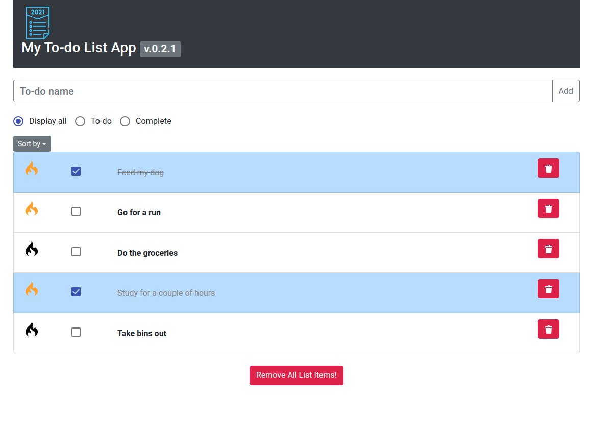

# My To-do List App v.0.2.1d

> **DEPLOYED SITE [here!](https://horacinis-todo.netlify.app/)**

### Table of Contents

  - [Description](#description)
  - [Features](#features)
  - [Technologies](#technologies)
  - [Installation](#installation)
  - [Run The app](#run-the-app)
  - [Testing](#testing)
  - [License](#license)
  - [Author Info](#author-info)
## Description
My To-do List App v.0.2.1d is a simple and awesome app to organize your tasks, and get things done with very easy to use interface. 

*(This app, in the near future will be hooked to a database where your to-do's will be stored safely)*

## Features
- Add a task with ease.
- You can set priority to the task by tapping on the flame icon.
- Set a task as 'completed'.
- You can sort your tasks by: name, priority, completed or time created.
- You have the option to display all your tasks, your yet todo tasks or your completed ones.
- Easily remove your tasks one by one or all of them at once.

### Technologies
- JavaScript
- ReactJS
- HTML
- CSS
- React-Bootstrap
- Material-UI
- React-Icons
- Visual Studio Code
- Netlify

---
## Installation
### `npm install` 

## Run the app
### `npm start`
Open [http://localhost:3000](http://localhost:3000) to view it in the browser.

## Testing
### `npm testing`

### License

MIT License

Copyright (c) [2021] [Horacio M.]

Permission is hereby granted, free of charge, to any person obtaining a copy
of this software and associated documentation files (the "Software"), to deal
in the Software without restriction, including without limitation the rights
to use, copy, modify, merge, publish, distribute, sublicense, and/or sell
copies of the Software, and to permit persons to whom the Software is
furnished to do so, subject to the following conditions:

The above copyright notice and this permission notice shall be included in all
copies or substantial portions of the Software.

THE SOFTWARE IS PROVIDED "AS IS", WITHOUT WARRANTY OF ANY KIND, EXPRESS OR
IMPLIED, INCLUDING BUT NOT LIMITED TO THE WARRANTIES OF MERCHANTABILITY,
FITNESS FOR A PARTICULAR PURPOSE AND NONINFRINGEMENT. IN NO EVENT SHALL THE
AUTHORS OR COPYRIGHT HOLDERS BE LIABLE FOR ANY CLAIM, DAMAGES OR OTHER
LIABILITY, WHETHER IN AN ACTION OF CONTRACT, TORT OR OTHERWISE, ARISING FROM,
OUT OF OR IN CONNECTION WITH THE SOFTWARE OR THE USE OR OTHER DEALINGS IN THE
SOFTWARE.
## Author Info

- Twitter - [@HORACINIS](https://twitter.com/horacinis)
- GitHub - [Horacio M.](https://www.linkedin.com/in/horacio-moran-837a891b4/)
- Website - [Horacinis - Portfolio](https://horacinisdev.netlify.app/)

[Back To The Top](#my-to-do-list-app-v.0.2.1d)
